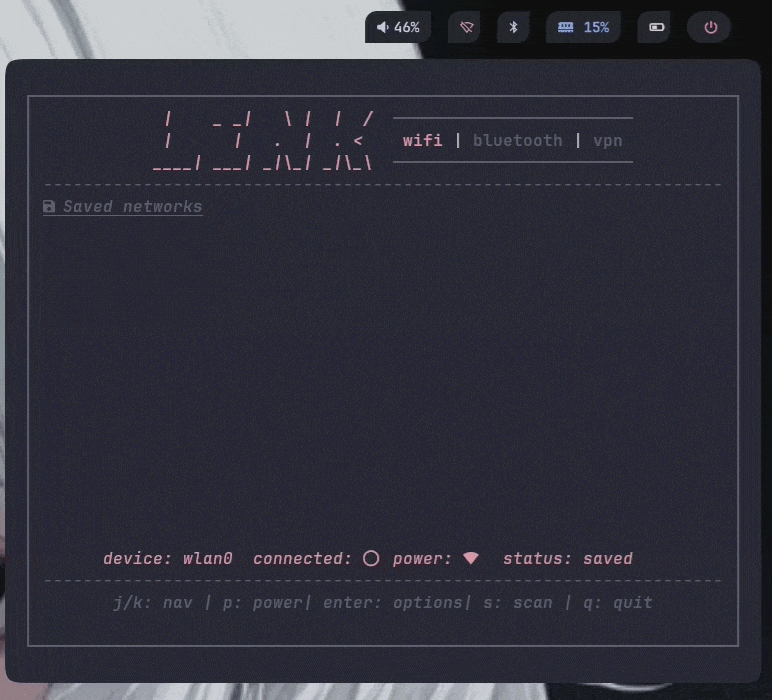

# linktui

> A fast, minimal terminal UI for managing Wi-Fi, Bluetooth, and WireGuard VPN on Linux — built with [Bubble Tea](https://github.com/charmbracelet/bubbletea).

---

## Demo



---

## Features

- **Wi-Fi** — scan nearby access points, connect with password prompt, manage saved profiles (autoconnect toggle, forget)
- **Bluetooth** — discover devices, pair with passkey confirmation, manage known devices, toggle power/discoverable/pairable
- **WireGuard VPN** — list tunnel profiles, activate/deactivate links, create new profiles via form, import `.conf` files via file picker, display public IP info
- Tab navigation with `Tab` / `Shift+Tab`
- Lazy-loads each tab on first visit for fast startup
- Fully themeable via `config.toml`
- Respects configured window dimensions — warns if terminal is too small

---

## Dependencies

### Runtime

[BlueZ](http://www.bluez.org/) (`bluetoothd`) - Bluetooth backend via D-Bus
D-Bus - IPC for NetworkManager and BlueZ communication

Ensure NetworkManager and BlueZ daemons are running:

```sh
sudo systemctl enable --now NetworkManager
sudo systemctl enable --now bluetooth
```

### Build (Go modules)

| Module                                | Used for                                  |
| ------------------------------------- | ----------------------------------------- |
| `charm.land/bubbletea/v2`             | TUI framework                             |
| `charm.land/lipgloss/v2`              | Terminal styling                          |
| `charm.land/bubbles/v2`               | Table, text input, file picker components |
| `github.com/Wifx/gonetworkmanager/v3` | NetworkManager Go bindings                |
| `github.com/godbus/dbus/v5`           | D-Bus bindings for BlueZ                  |
| `github.com/BurntSushi/toml`          | Config file parsing                       |

---

## Installation

### AUR (Arch Linux)

```sh
# Using yay
yay -S linktui

# Using paru
paru -S linktui

# Manually
git clone https://aur.archlinux.org/linktui.git
cd linktui
makepkg -si
```

### GitHub Releases (pre-built binary)

Download the latest binary from the [Releases page](https://github.com/yourusername/linktui/releases).

```sh
# Download and install (replace VERSION and ARCH as needed)
curl -Lo linktui https://github.com/yourusername/linktui/releases/latest/download/linktui-linux-amd64
chmod +x linktui
sudo mv linktui /usr/local/bin/
```

### Build from source

Requires Go 1.22+.

```sh
git clone https://github.com/yourusername/linktui.git
cd linktui
go build -o linktui ./cmd/linktui
sudo mv linktui /usr/local/bin/
```

---

## Usage

```sh
# Open on the Wi-Fi tab (default)
linktui

# Open directly on a specific tab
linktui --tab=wifi
linktui --tab=bluetooth
linktui --tab=vpn
```

### Keybindings

`Tab` / `Shift+Tab` - Switch tabs
`j` / `k` / `arrows` - Navigate list up/down
`q` - Quit
`Ctrl+C` - Force quit

**Wi-Fi tab**

`s` - Toggle scan mode  
`Enter` - Connect (scan mode) / Options (saved mode)
`p` - Toggle adapter power

**Bluetooth tab**

`s` - Start/stop discovery scan
`Enter` - Device actions menu  
`p` - Toggle power  
`d` - Toggle discoverable
`b` - Toggle pairable

**VPN tab**

`n` - Create new WireGuard profile
`i` - Import `.conf` file
`Enter` - Actions menu (activate/deactivate/delete)
`p` - Fetch public IP info

---

## Ricing

linktui looks for a config file at:

```
~/.config/linktui/config.toml
```

If the file is absent, built-in defaults are used. All values are optional — only override what you need.

### Example `config.toml`

```toml
[window]
width  = 80
height = 28

[colors]
foreground           = "#CDD6F4"
background           = "#1E1E2E"
accent               = "#89B4FA"
highlight            = "#CBA6F7"
highlight_background = "#313244"
muted                = "#6C7086"
border               = "#45475A"
popup_background     = "#181825"
log_background       = "#11111B"
cursor               = "#F5E0DC"
```

> **Note:** `width` and `height` set the UI canvas size, not the terminal window size. The terminal must be at least as large as the configured dimensions — linktui will display a warning if it isn't.

### Minimum dimensions

`width` - 70
`height` - 25

---

### Hyprland

linktui can be launched as a floating overlay window anchored to the top-right corner of your screen — useful as a quick-access panel triggered from a keybind or Waybar click.

Add this window rule to your `hyprland.conf`:

```lua
-- ### LINKTUI TOP RIGHT WINDOW RULE ###
hl.window_rule({
    name  = "linktui-top-right",
    match = { title = "^(linktui)$" },
    float = true,
    size  = "630 520",
    move  = { "monitor_w - window_w - 10", 50 },
})
```

> **Note on font rendering:** The `size` values above assume a standard monospace font at a typical size (e.g. JetBrains Mono / Nerd Font at 12–13pt). If your terminal font is larger or smaller, the window may clip content or leave excess space. Tune `width`/`height` in your `config.toml` and the `size` rule together until the fit is clean. A good starting point: each character cell is roughly `8×16px` at 12pt — so a 80×28 terminal canvas needs approximately `640×450px`.

---

### Waybar

The recommended setup uses a small toggle script so clicking a Waybar module opens linktui in a floating terminal and a second click closes it.

**1. Create the toggle script**

Save this to `~/.config/waybar/scripts/toggle-linktui.sh` and make it executable:

```sh
chmod +x ~/.config/waybar/scripts/toggle-linktui.sh
```

```bash
#!/bin/bash
# ~/.config/waybar/scripts/toggle-linktui.sh
if pgrep -f "kitty.*linktui" >/dev/null; then
  pkill -f "kitty.*linktui"
else
  kitty --title "linktui" -e linktui "$1"
fi
```

> Replace `kitty` with your terminal emulator. The `--title "linktui"` flag is what the Hyprland window rule matches on — keep it consistent.

**2. Wire up the Waybar modules**

Add `on-click` to your existing `network` and `bluetooth` module entries. Only the relevant lines are shown — merge these into your full module config:

```jsonc
"network": {
    // ... your existing format/icon config ...
    "on-click": "~/.config/waybar/scripts/toggle-linktui.sh --tab=wifi"
},

"bluetooth": {
    // ... your existing format/icon config ...
    "on-click": "~/.config/waybar/scripts/toggle-linktui.sh --tab=bluetooth"
}
```

Clicking the network widget opens linktui on the Wi-Fi tab; clicking again closes it. The bluetooth widget does the same on the Bluetooth tab.

---

## Permissions

linktui communicates with system daemons over D-Bus and does not require `sudo`. Your user must be in the appropriate groups or have polkit policies that allow NetworkManager and BlueZ interactions.

On most distributions, logging in via a desktop session handles this automatically. If you run into permission errors in a minimal/headless setup:

```sh
# Add your user to the 'network' group if required by your distro
sudo usermod -aG network $USER
```

---

## License

MIT — see [LICENSE](./LICENSE) for details.
